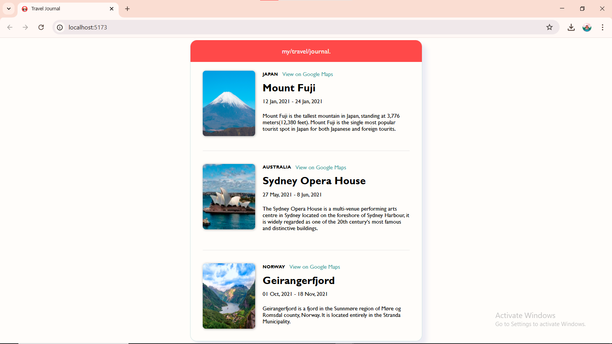

# Travel Journal

A simple static travel journal web app built with **React** and **Vite**. This project showcases beautiful destinations using component-based architecture and image assets. 

## Getting Started

### 1. Clone the Repository

```bash
git clone https://github.com/your-username/vite-TravelJournalStatic.git
cd vite-TravelJournalStatic
```

### 2. Install Dependencies

```bash
npm install
```

### 3. Run the App

```bash
npm run dev
```

### 4. Build for Production

```bash
npm run build
```

## Acknowledgements

Inspired by **Scrimba React Projects**.



<!--
# React + Vite

This template provides a minimal setup to get React working in Vite with HMR and some ESLint rules.

Currently, two official plugins are available:

- [@vitejs/plugin-react](https://github.com/vitejs/vite-plugin-react/blob/main/packages/plugin-react/README.md) uses [Babel](https://babeljs.io/) for Fast Refresh
- [@vitejs/plugin-react-swc](https://github.com/vitejs/vite-plugin-react-swc) uses [SWC](https://swc.rs/) for Fast Refresh
-->
